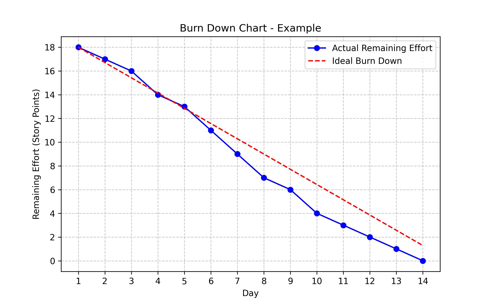

# 🚀 Creating and Updating Burn Down Charts  

## Overview  
A **Burn Down Chart** is a visual tool used in Scrum to track sprint progress. It shows the remaining work (story points) over time, helping teams assess whether they are on track to complete all planned user stories within the sprint.

### **Key Components of a Burn Down Chart**
- **X-Axis:** Sprint Days (Day 1 to Day 14 in a 2-week sprint).  
- **Y-Axis:** Remaining Effort (Story Points).  
- **Ideal Burn Down Line:** A straight line representing the expected reduction of story points if work progresses perfectly.  
- **Actual Burn Down Line:** A real-time curve based on actual task completion, which may fluctuate due to unforeseen challenges or early completions.

---

## **Example: Burn Down Chart for Sprint 1 (Smart Parking System)**  

| Day  | Actual Remaining Effort (Story Points) |
|------|--------------------------------------|
| 1    | 18                                   |
| 2    | 17                                   |
| 3    | 16                                   |
| 4    | 14                                   |
| 5    | 13                                   |
| 6    | 11                                   |
| 7    | 9                                    |
| 8    | 7                                    |
| 9    | 6                                    |
| 10   | 4                                    |
| 11   | 3                                    |
| 12   | 2                                    |
| 13   | 1                                    |
| 14   | 0                                    |

---

## **Interpreting the Chart**
- **Ideal Burn Down Curve:**  
  - A steady, linear reduction in effort (Reference).  

- **Actual Burn Down Curve:**  
  - This reflects the **real progress** during the sprint.  
  - In the example above:
    - Progress **lags** behind initially (Days 2-5).
    - The team **catches up** in the second half of the sprint (Days 6-10).
    - A final push ensures all work is completed by Day 14.

---

## **How to Create and Update Burn Down Charts**
1. **Set up the chart:**
   - Plot the total sprint effort (e.g., 18 story points) on Day 1.
   - Draw an **ideal burn down line**.
   - Use a spreadsheet tool, Jira, or Git-based tracking tools to generate the chart.

2. **Update the chart daily:**
   - At the end of each day, update the **actual remaining effort** based on completed tasks.
   - If work is delayed, adjust projections for upcoming days.
   - Communicate any major deviations with the Scrum team.

3. **Analyze trends and take action:**
   - If the **actual line stays above the ideal line**, identify blockers and reprioritize work.
   - If the team **finishes early**, consider pulling in low-priority backlog items.
   - Discuss sprint progress during **Daily Standups and Sprint Retrospectives**.

---

## **Example Representation of a Burn Down Chart**

---

## **Final Notes**
- The burn down chart is a **living document**— ideally it should be updated after daily or several times a week!
- Focus on **trend analysis** rather than individual points.
- Ensure all team members **understand and contribute** to maintaining accurate data.
- The **goal is to reach 0 points by the end of Day 14** while maintaining sustainable development practices.

---
